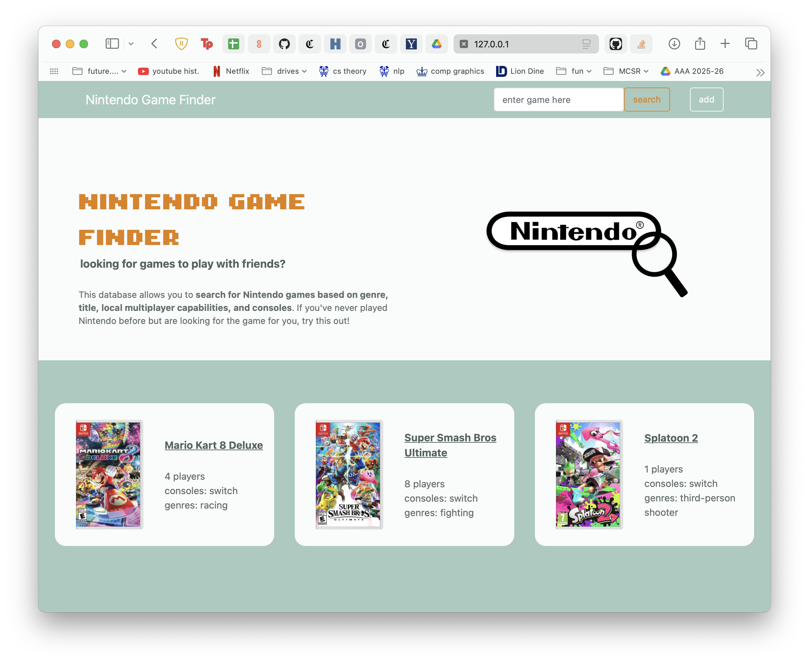
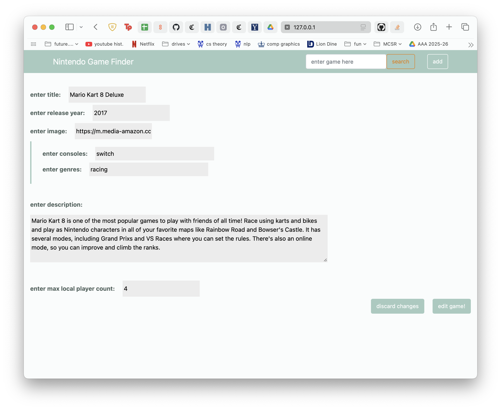
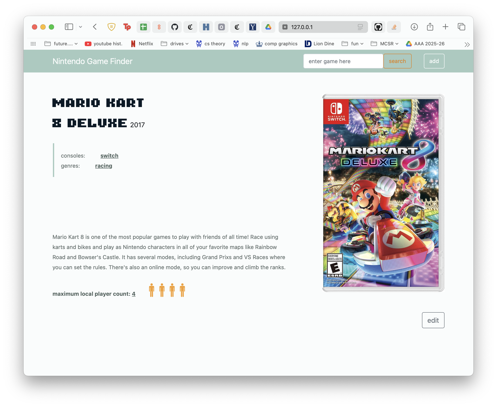
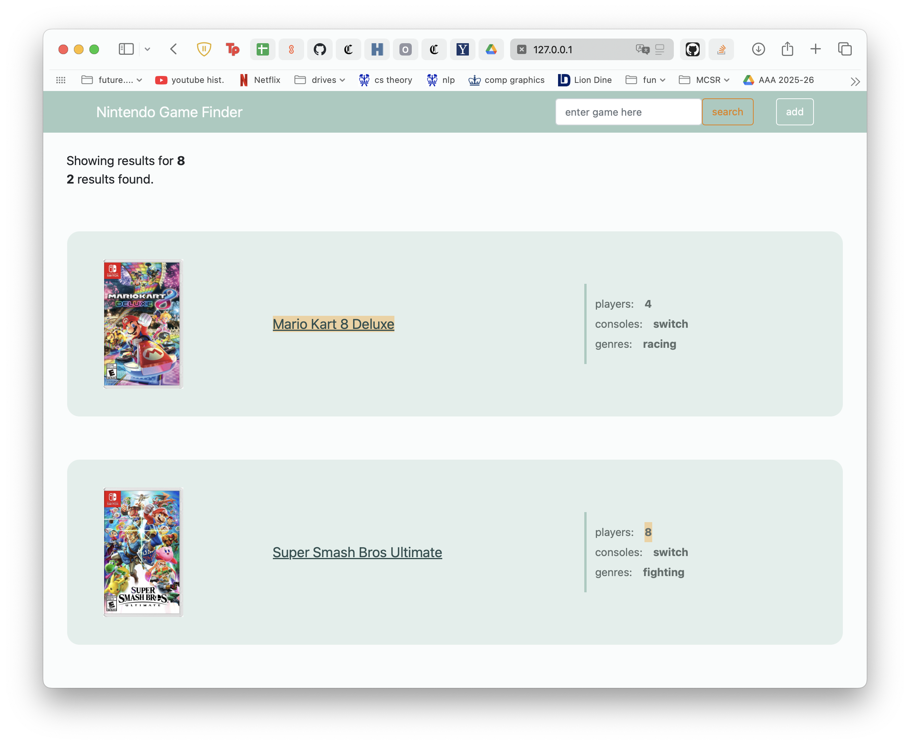

# UI Design Sample Project

This is a sample of my work that I did for my UI Design class at Columbia in
Spring 2025. 

## Preview









## Installation

```bash
# Clone the repository
git clone https://github.com/yourusername/your-repo-name.git

# Navigate to the project directory
cd your-repo-name
```

## Usage

```bash
# Run the application
python3 server.py
```